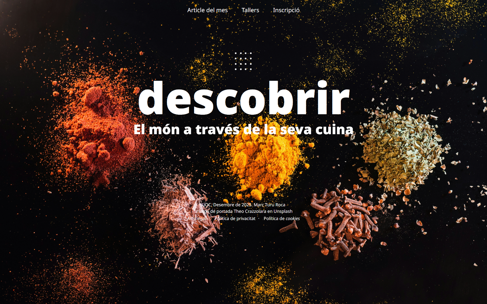
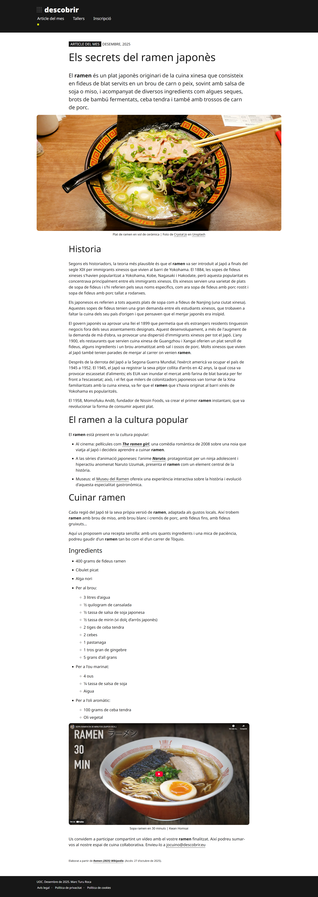
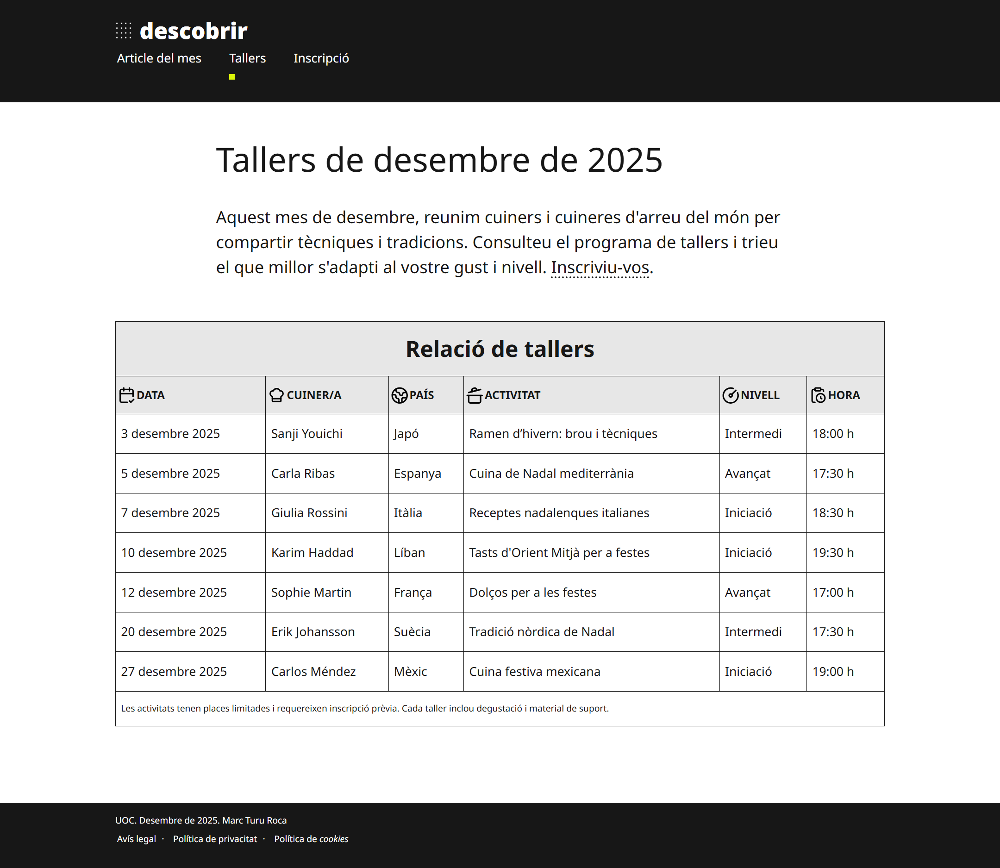
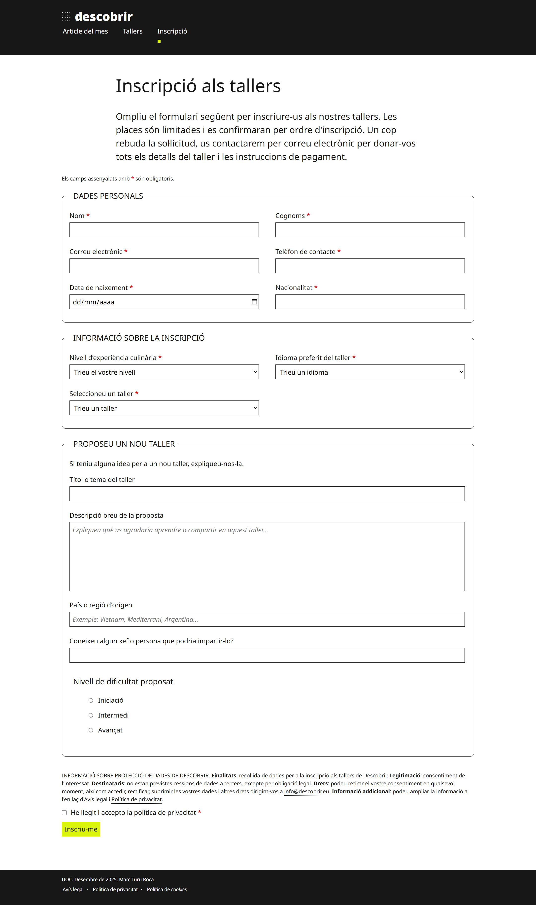
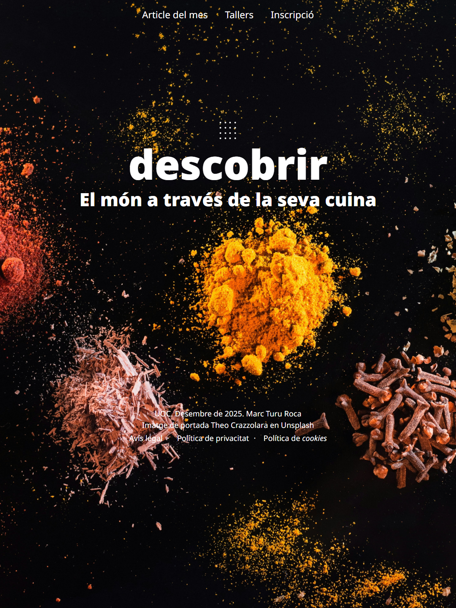
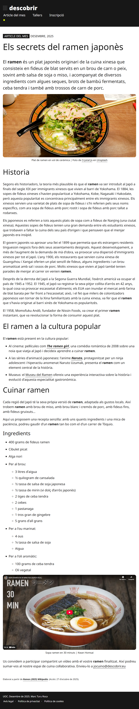
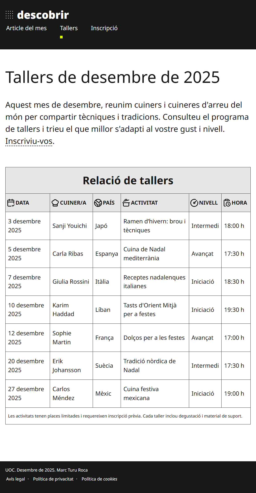
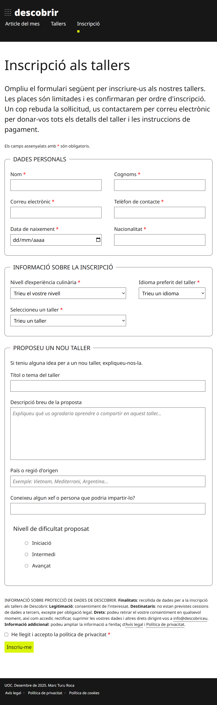
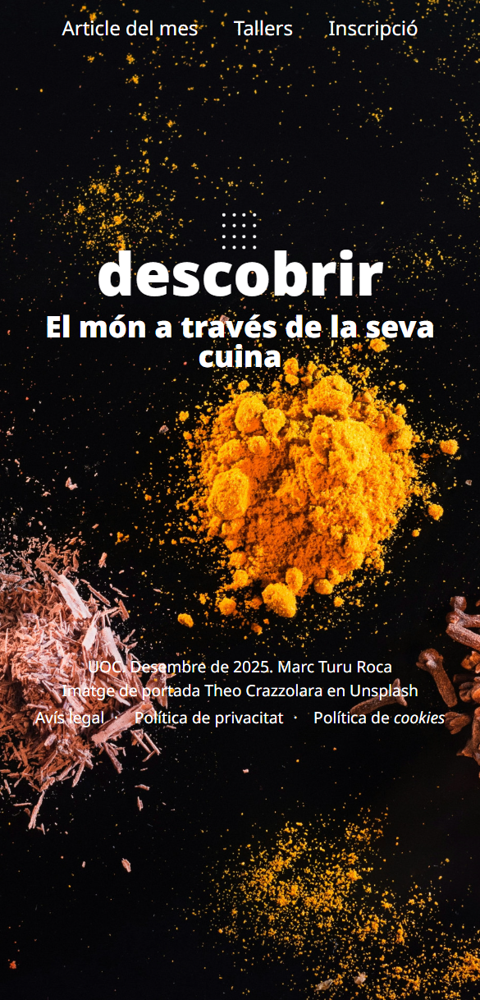
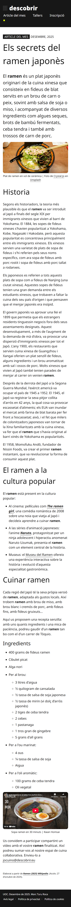

#  — Gastronomic portal

<sub>🗓️ Developed in December 2025</sub>

This project is a **structured and semantic gastronomic portal developed with HTML5 & CSS3**, composed of four pages: `index.html`, `article-del-mes.html`, `tallers.html`, and `inscripcio.html`, along with additional assets such as CSS stylesheets in `/css` and images in `/img`.  
The goal of this project was to reinforce and solidify concepts from **Web Fonts, Tables, Forms, and Advanced CSS Styling**, presenting well-organized HTML documents using semantic elements, structured forms, accessible components, and consistent styling.

---

## ✅ Features

- Proper structuring for **HTML5 documents**, including `<!DOCTYPE html>`, `<html lang="ca">`, `<head>`, `<body>`, `<header>`, `<nav>`, `<main>`, and `<footer>`.
- **Semantic organization** using `<article>` and `<section>` (article page), with clear hierarchy through headings (`h1`, `h2`, `h3`, `h4`) and structured text (`p`).
- Use of **unordered lists** (`ul`, `li`) for navigation and categorized content.
- Structured **tables** using `<table>`, `<thead>`, `<tbody>`, `<tfoot>`, `<tr>`, `<th>`, and `<td>`.
- Fully structured **forms** using `<form>`, `<fieldset>`, `<legend>`, `<label>`, `<input>`, `<select>`, `<textarea>`, and `<button>`.
- Input validation using attributes such as `pattern`, `maxlength`, `required`, and specific input types (`text`, `email`, `tel`, `date`, `radio`, `checkbox`).
- **Semantic inline elements** including `<cite>`, `<abbr>`, `<em>`, and `<strong>`.
- **Multimedia and embedded content**, including images and video embedded via `<figure>`, `<figcaption>`, ``, and `<iframe>`.
- **CSS styling and custom properties**: Use of `:root` variables, reset rules, element redefinitions, responsive techniques (`aspect-ratio`, `clamp`, `vw`, `vh`, `rem`, `%`), hover/focus states, and smooth transitions.
- **Accessibility and validation**: Pages validated with W3C tools and structured following semantic and accessibility best practices (ARIA usage, proper label association, structured fieldsets).

---

## 🛠 Installation & Setup

### 1. Clone the repository
```bash
git clone https://github.com/marcturu/descobrir.git
cd descobrir
```

### 2. Try the webpage locally
Open the `.html` files directly in a browser or use **Live Server**.   

The webpage will typically be available at **http://127.0.0.1:5500/**.

---

## 📂 Documentation

All additional documentation is in the `/DOCS` directory:
- **HTML entities**
- **CSS styles**
- **Significant aportations**
- **Accessibility and validation** 

---

## 📷 Screenshots

### Index (Desktop)


### Article del Mes (Desktop)


### Tallers (Desktop)


### Inscripció (Desktop)


### Index (Tablet)


### Article del Mes (Tablet)


### Tallers (Tablet)


### Inscripció (Tablet)


### Index (Mobile)


### Article del Mes (Mobile)


### Inscripció input (1)
.jpg)

### Inscripció input (2)
.jpg)

---

## ⚖️ Copyright & License

© 2025 Marc Turu Roca. All rights reserved.

This project and its contents are the exclusive intellectual property of Marc Turu Roca.  
All rights reserved. No part of this project may be copied, modified, distributed, or used without prior written permission from the author.
